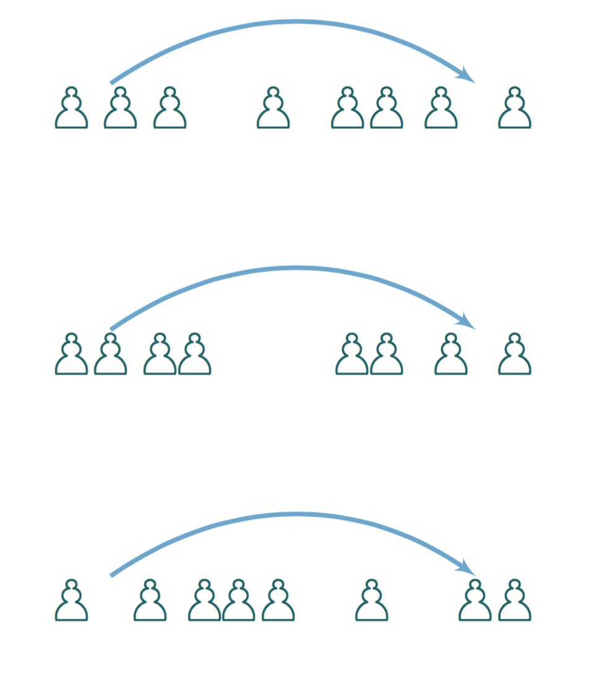

**PSIlence** is a package for the R statistical language, that implements differentially private algorithms for releasing statistics while safeguarding the privacy of individuals in the raw data. 

It provides the underlying algorithms for *PSI(\Psi): a Private data Sharing Interface*, a system created to enable researchers in the social sciences and other fields to share and explore privacy-sensitive datasets with the strong privacy protections of differential privacy ([Project](http://privacytools.seas.harvard.edu/psi)|[Paper](https://arxiv.org/abs/1609.04340)).  However, it can be used by itself in any application needing code for differentially private mechanisms.